# **STConvS2S Level-Aware: Convolução Vertical para Previsão de Precipitação**
- **Alunos:** Daniel Medeiros, Ennya Gomes e Lucas Rocha
- **Disciplina:** CIC1205 — Machine Learning | Prof. Eduardo Bezerra
- **Trabalho:** T3 — Tema 4 | CEFET/RJ, Junho 2026
- **Artigo base (FUSION 2025):** https://arxiv.org/pdf/2505.19258

---

## **Introdução**

No artigo da FUSION 2025, a STConvS2S foi aplicada ao estado do Rio de Janeiro integrando dados 
ERA5, previsões GFS e medições de estações pluviométricas (Sirenes, INMET, AlertaRio). Nessa 
formulação, variáveis meteorológicas medidas em múltiplos níveis de pressão atmosférica (200, 700 e 
1000 hPa) são organizadas como canais de entrada independentes — sem preservar a estrutura 
vertical da atmosfera.

**Pergunta orientadora:** Tratar os níveis atmosféricos como uma dimensão vertical estruturada 
melhora a previsão de precipitação em comparação com a representação tradicional por canais?

A hipótese principal é que gradientes verticais na coluna atmosférica (como ar subindo de 1000 para 
200 hPa em eventos convectivos) são mais difíceis de aprender quando os níveis são empilhados 
como canais independentes. Uma representação que trate os níveis como dimensão estruturada 
pode, em princípio, capturar esses padrões de forma mais eficaz. 

---
## **Problemas**

O principal desafio científico do trabalho é o severo desbalanceamento da base de dados.
Eventos de chuva fraca representam ≈ 99,7% das amostras, enquanto os eventos de interesse
operacional (Moderada, Forte e Extrema) somam menos de 0,3%. Isso significa que um modelo
que prevê "zero" para tudo obtém RMSE baixo e nunca é penalizado — o que dificulta
o aprendizado de padrões associados a chuvas intensas.

A hipótese investigada é se a representação level-aware, ao preservar a estrutura vertical
da atmosfera, permite que o modelo capte gradientes entre níveis de pressão  e com isso contribuindo para a detecção de chuvas Moderadas e Fortes mesmo sem dados suficientes dessas classes.

---

## **Dados Utilizados**
- ERA5+SAI.nc - Base de dados criada no arquivo FUSION, que reúne dados do estado do Rio de Janeiro provenientes do ERA5 (base global de reanálise climática com cobertura desde 1940) combinados com registros de estações pluviométricas.

### **Informações do ERA5+SAI.nc**

| Informações | Valores |
|----------|----------|
| Período  | Jan 2011 - Out 2024   | 
| Amostras | 89.482   | 
| Grade    | 9 x 11 células | 
| Janela   | T = 5h entrada, T=5h saída   | 
| Canais   | 19(1 sup + 6 vars × 3 níveis)*   | 
| Split   | 60% treino / 20% val / 20% teste   |  

*19 Canais - 1 sup é a Precipitação total e são 6 variáveis para cada nível de pressão(1000 / 700 / 200 hPa)

| Nome | Variável |
|----------|----------|
| r  | Umidade relativa   | 
| t  | Temperatura   | 
| u  | Vento zonal (leste-oeste)   | 
| v  | Vento meridional (norte-sul)  | 
| speed | Velocidade do vento |
| w  | Velocidade vertical   | 

### **Divisão dos dados**
| Classe precipitação | Quantidade(%) |
|----------|----------|
| Fraca [0,5) mm/h | ≈ 99,7% |
| Moderada [5,25) mm/h | ≈ 0,2% |
| Forte [25,50) mm/h | ≈ 0,04% |
| Extrema [50,∞) mm/h| < 0,01% |

---

## **Primeira parte do trabalho** 

O objetivo desta etapa é transformar o formato original do ERA5+SIA.nc(que organiza
todas as variáveis como 19 canais em uma única dimensão) em um formato 3D onde cada
nível de pressão é uma dimensão explícita, com suas 6 variáveis associadas.

### **Formato original — XCH (19 canais flat)**

No arquivo ERA5+SIA.nc, as variáveis de três níveis de pressão diferentes são empilhadas
sequencialmente na mesma dimensão de canal, sem distinção estrutural entre elas:

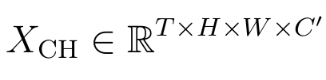

### **Formato proposto - XLV (3D level-aware)**

O XLV reorganiza os mesmos dados para que a dimensão de nível seja explícita: 

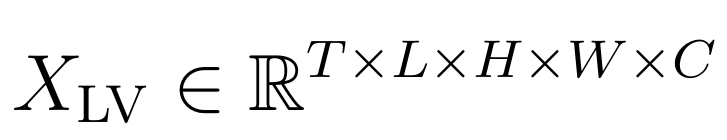

- L = 3 níveis 
- C = 7 variáveis (tp, r, t, u, v, speed, w)
- tp apenas em nível 0 (1000hPa)
- Preserva a estrutura vertical da atmosfera


### **Código**

Para a transformação da base de dados foi desenvolvido o notebook `codigos/gera_dataset.ipynb`,
que lê o `ERA5+SIA.nc` original e gera o arquivo `ERA5+SIA_XLV.nc` no formato 3D.

*É necessário pegar o dataset original, pode pegar pelo link: https://zenodo.org/records/14941806

#### **Ambiente**

Recomendamos usar o Anaconda para criar o ambiente a partir do arquivo fornecido(codigos/environment-history.yml):

```bash
# Clonar o ambiente
conda env create -f codigos/environment-history.yml

# Ativar
conda activate atmoseer
```

Comentário adicional, durantes os testes deram alguns erros, recomendamos rodar o comando abaixo caso de algum problema na hora de rodar o notebook:

```bash
conda remove distributed -n atmoseer
```
  
#### **Executando o notebook**
Para executar o notebook pode abrir o notebook(selecionar o modo Kernel no canto superior direito do notebook - selecionar atmoseer) ou pela linha de comando abaixo:

```bash
jupyter notebook codigos/gera_dataset.ipynb
```

O notebook realiza as seguintes etapas:

1. Carrega o `ERA5+SIA.nc` via `xarray`
2. Valida o mapeamento dos 19 canais com 4 amostras antes de processar tudo
3. Converte o formato flat `(N, T, H, W, 19)` → 3D `(N, T, H, W, L=3, C=7)` usando a função `build_volume_3d`
4. Salva o resultado em `ERA5+SIA_XLV.nc` via `netCDF4` direto em chunks de 500 amostras
5. Executa um checklist de validação (sem NaNs, tp zero nos níveis superiores, etc.)

> O arquivo gerado ocupa aproximadamente **7,5 GB**. Certifique-se de ter espaço disponível

#### **Resultados**
**Base de dados original**

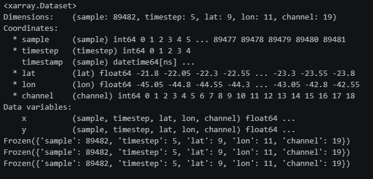

**Base de dados nova**

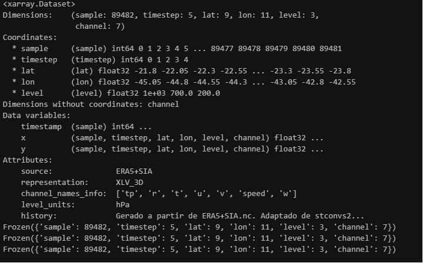

**Comparação**

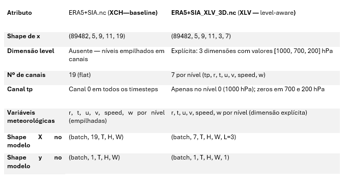

A principal diferença estrutural é a presença da dimensão level no XLV. No XCH, as variáveis de 200, 700 e 1000 hPa são simplesmente concatenadas na dimensão de canal, o modelo não sabe que canais 1, 2 e 3 representam o mesmo tipo de variável em altitudes diferentes. No XLV, essa informação é preservada como dimensão explícita, permitindo que o VerticalSpatialBlock aprenda convoluções ao longo da coluna atmosférica.

---

## **Segunda parte**
Nessa segunda parte vamos pegar o baseline(base de dados original) e comparar com a estratégia de dados level-aware(dividido em três níveis). Vamos testar rodando o baseline como o Felipe Nieto recomendou. Para testar o XLV vamos rodar uma vez sem o bloco usando o comando que o Felipe Nieto também recomendou e usando o Bloco vertical-espacial
 - Baseline XCH
 - Level-aware XLV sem bloco
 - Level-aware XLV bloco 3x1x1
 - Level-aware XLV bloco 3x3x3

### **Requisito**
Para essa etapa precisa da arquitetura que foi usada(STConvS2S), link para arquitetura: https://github.com/AILAB-CEFET-RJ/stconvs2s

Também é preciso criar o ambiente a partir do arquivo fornecido(codigos/environment-history.yml)

### **Bloco Vertical**

O VerticalSpatialBlock é adicionado antes da STConvS2S original, que não é modificada. Recebe o 
tensor XLV e produz uma representação compatível com a STConvS2S: 

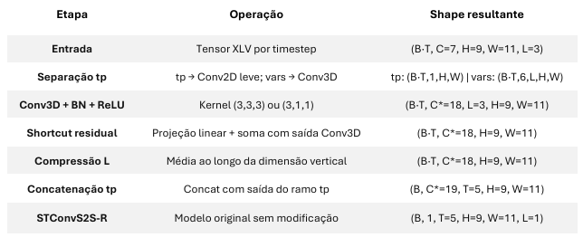
### **Código**
> Para rodar o baseline (Passo recomendados pelo Felipe Nieto)

Precisa do repositório STConvs2s e que esse repositório esteja na branch main e rodar o comando na pasta STConvS2S.

Também precisa estar com o ambiente(codigos/environment-history.yml) ativo 

```bash
cd STConvS2S ## Entrar na pasta correta

git checkout main ## Mudar de brach 

conda activate atmoseer ## Ativar ambiente


## Comando para rodar o projeto 
python main.py --cuda 1 -i 1 -v 4 -m stconvs2s-r -e 10 -p 100 --plot --dropout 0.5 -dsp "{pasta_arquivo}\ERA5+SIA.nc" -r "RunModels_ERA5+SIA" -w 0
```

> Para rodar o Level-aware XLV sem bloco (Passo recomendados pelo Felipe Nieto)

Precisa do repositório STConvs2s e que esse repositório esteja na branch main e rodar o comando na pasta STConvS2S.

Também precisa estar com o ambiente(codigos/environment-history.yml) ativo 
```bash
cd STConvS2S ## Entrar na pasta correta

git checkout feat/4D-architecture ## Mudar de brach 

conda activate atmoseer ## Ativar ambiente

## Comando para rodar o projeto 
python main.py --cuda 1 -i 1 -v 4 -m stconvs2s-r -e 10 -p 100 --plot --dropout 0.5 -dsp "{pasta_arquivo}\ERA5+SIA_XLV_3D.nc" --target-channels 0 --target-levels 0 -r "production_run" -w 0
```


> Para rodar o Level-aware XLV Bloco 3x1x1

Precisa do repositório STConvs2s e que esse repositório esteja na branch main e rodar o comando na pasta STConvS2S.

Também precisa estar com o ambiente(codigos/environment-history.yml) ativo. 

Precisa colocar o código - (codigos/train_lv_block.py) dentro da pasta do STConvS2S

Precisa coloca o código - (codigos/vertical_block.py) dentro da pasta do STConvS2S/model
```bash
## Com os arquivos dentro da pasta só rodar o proejto
## Comando para rodar o projeto 
python train_lv_block.py -dsp "ERA5+SIA_XLV_3D.nc" -e 10 -p 100 -r "LV_block_311" --kernel-lv 3 1 1  --compression mean -w 0 
```

> Para rodar o Level-aware XLV Bloco 3x3x3

Precisa do repositório STConvs2s e que esse repositório esteja na branch main e rodar o comando na pasta STConvS2S.

Também precisa estar com o ambiente(codigos/environment-history.yml) ativo. 

Precisa colocar o código - (codigos/train_lv_block.py) dentro da pasta do STConvS2S

Precisa coloca o código - (codigos/vertical_block.py) dentro da pasta do STConvS2S/model
```bash
## Com os arquivos dentro da pasta só rodar o proejto
## Comando para rodar o projeto 
python train_lv_block.py -dsp "ERA5+SIA_XLV_3D.nc" -e 10 -p 100 -r "LV_block_333" --kernel-lv 3 3 3  --compression mean -w 0 
```


### **Resultados**
>Análise dos Resultados Oficiais (1 época)

| Modelo | Test RMSE | Test MAE | Val RMSE | F1 Moderada | TPs Moderada | Tempo |
|----------|----------|----------|----------|----------|----------|----------|
| CH (baseline)  | 0.1495 | 0.1495 | 0.1499 |0.0010 | 37 | 4 min|
| LV sem bloco   | 0.1436 | 0.1436 | 0.1442 | 0.0013 | 49 | 35 min |
| LV Bloco 3×1×1 | 0.3054 | **0.1426**| 0.1556 |**0.1044** | **5.346** | 7 min |
| LV Bloco 3×3×3 | 0.3195 | 0.1526 | 0.1661 | 0.0000 | 0 | 8 min |

| Modelo | t1 | t2 | t3 | t4 | t5 | 
|----------|----------|----------|----------|----------|----------|
| CH (baseline)  | 0.145 | 0.149 | 0.154 | 0.150 | 0.149 | 
| LV sem bloco   | 0.141 | 0.140 | 0.142 | 0.145 | 0.150 | 
| LV Bloco 3×1×1 | 0.281 | 0.293 | 0.305 | 0.317 | 0.329 | 
| LV Bloco 3×3×3 | 0.316 | 0.317 | 0.318 | 0.321 | 0.324 | 

**Matriz confusão**

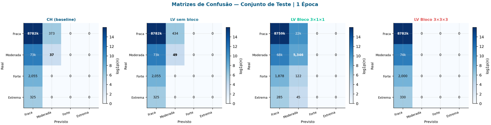

**RMSE por Horizonte de previsão**

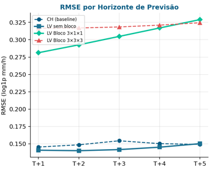

**F1-Score classe moderada**

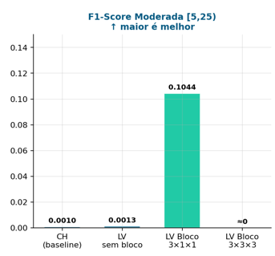

>Análise dos Resultados Oficiais (10 épocas) *Com a possibilidade de entregar até segunda rodamos novamente os teste mas com 10 épocas agora

| Modelo | Test RMSE | Test MAE | Val RMSE | F1 Moderada | TPs Moderada | Tempo |
|----------|----------|----------|----------|----------|----------|----------|
| CH (baseline)  | 0.1192 | 0.1192 | 0.1204 | 0.1199 | 5.332 | 43 min|
| LV sem bloco   | 0.1117 | 0.1117 | 0.1130 | 0.0753 | 2.974 | 5h 41 min |
| LV Bloco 3×1×1 | 0.2639 | 0.1115 | 0.1253 | 0.0813 | 3.278 | 1h 21 min |
| LV Bloco 3×3×3 | 0.2850 | 0.1206 | 0.1359 | 0.0065 | 2440  | 1h 26 min |

| Modelo | t1 | t2 | t3 | t4 | t5 | 
|----------|----------|----------|----------|----------|----------|
| CH (baseline)  | 0.108 | 0.113 | 0.121 | 0.124 | 0.130 | 
| LV sem bloco   | 0.101 | 0.102 | 0.109 | 0.118 | 0.128 | 
| LV Bloco 3×1×1 | 0.222 | 0.242 | 0.264 | 0.283 | 0.301 | 
| LV Bloco 3×3×3 | 0.269 | 0.274 | 0.283 | 0.293 | 0.305 | 


**Matriz confusão**

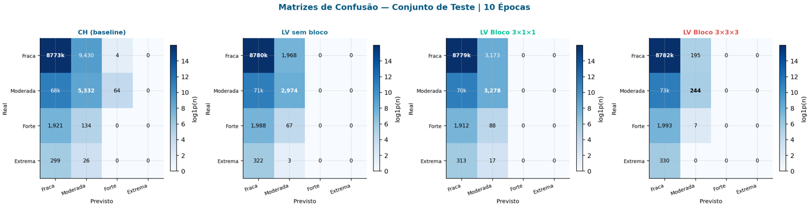


**RMSE por Horizonte de previsão**

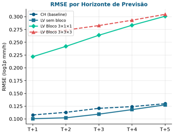

**F1-Score classe moderada**

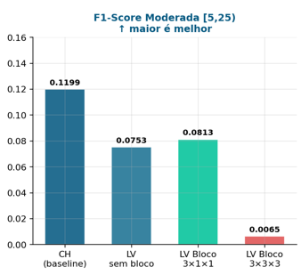

---

## Avaliação final 

Acreditamos que o dataset novo está bem interessante e pode ser usado no projeto de maneira efetiva, rodando o dataset novo sem o bloco que criamos mostrou resultados interessantes mas que demoram muito para executar. Os blocos que criar acreditamos que precisa melhorar o código e de mais testes para melhorar os resultados, não atingiram um nível ideal 

Resposta da pergunta orientadora:
A representação level-aware melhora o RMSE global quando 
combinada com o pipeline original (−6,3%). A adição do VerticalSpatialBlock introduz sensibilidade 
a eventos raros que não surge nos outros modelos, ao custo de RMSE maior em estágio inicial de 
treinamento. O Bloco 3×1×1 apresenta o melhor equilíbrio: melhor MAE de todos os modelos, F1 Moderada competitivo e treino 4× mais rápido que o LV sem bloco. 


## Documentos extras: 
- Documentação ERA5: https://confluence.ecmwf.int/spaces/CKB/pages/76414402/ERA5+data+documentation